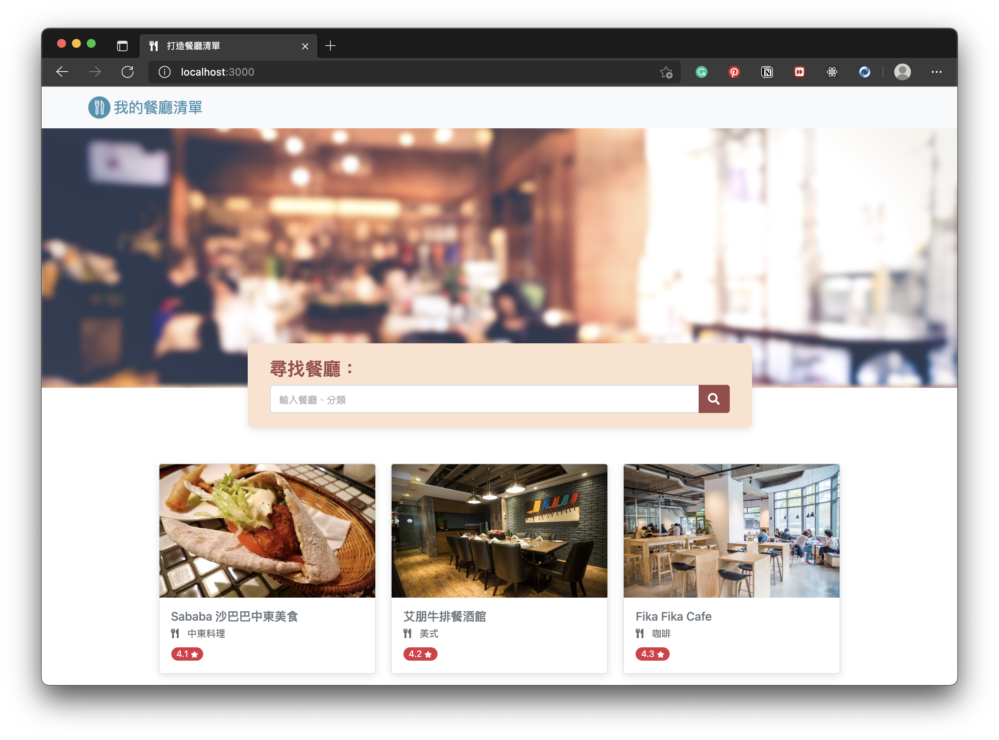

# 我的餐廳清單

此專案是用Node.js + Express 打造的餐廳網站，首頁顯示餐廳的基本資料，利用模板，自動化顯示重複的區塊；各餐廳分頁，則是透過動態路由的方式產生；並且有搜尋功能，透過關鍵字可以找到符合使用者需求的餐廳。

## 功能列表

基礎功能
- 依照餐廳名稱及餐廳類別搜尋
- 檢視餐廳詳細資訊包含類別、地址、電話、評分、圖片及 Google Map

程式優化項目
- 新增條件判斷式，讓搜尋欄位在有關鍵字時顯示關鍵字，沒有關機字時顯示“輸入餐廳、分類”，增加使用者體驗
- 將關鍵字搜尋的程式碼，提出成獨立的函式，讓餐廳名稱和餐廳分類的搜尋可以重複使用

畫面優化項目
- 整理Font Aewsome 的icon連結，並透過 [guager](https://gauger.io/fonticon/) 新增favicon
- 在各餐廳分頁中增加返回首頁的按鈕
- 調整各餐廳分頁的排版，並新增Footer 解決分頁圖片切到底部的問題，並讓網頁呈現更完整

## 安裝

1.開啟終端機(Terminal)，在自行設定好的資料夾，`clone`此專案機至本機電腦:

```
git clone https://github.com/jiarongtsai/restaurant.git
```

2.初始化設定-安裝套件

```
npm install  
```

3.開啟程式

```
npm run dev  
```

終端顯示 `The server is listening on port 3000` 即啟動完成，請至[http://localhost:3000](http://localhost:3000)開始使用程式


## 使用工具

- [Visual Studio Code](https://visualstudio.microsoft.com/zh-hant/) - 開發環境
- [Express](https://www.npmjs.com/package/express) - 應用程式架構
- [Express-Handlebars](https://www.npmjs.com/package/express-handlebars) - 模板引擎
- [Bootstrap](https://getbootstrap.com/) - 排版
- [Font Awesome](https://fontawesome.com/v6.0) - icon


## 致謝

- [README 文件撰寫參考](https://github.com/Eason0in/Restaurant-CRUD) - Eason
- [課程設計](https://tw.alphacamp.co/foundation-module)- AlphaCamp 學期2-3 打造餐廳清單
- [開發者](https://github.com/jiarongtsai)- Bella Tsai
